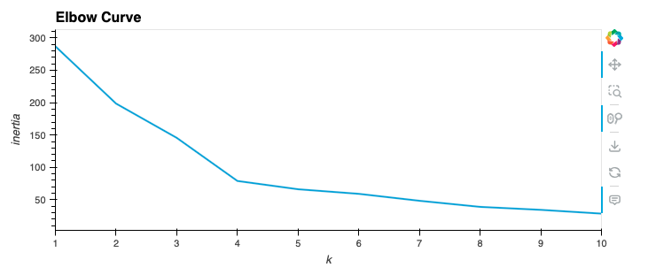
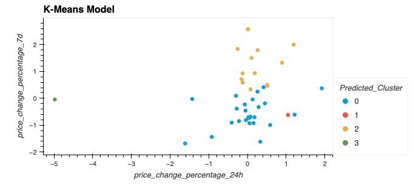
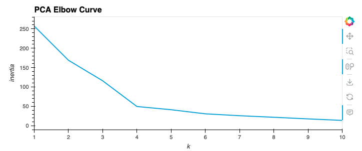
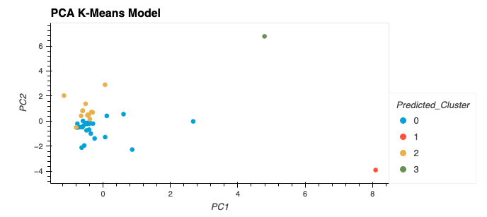

# CryptoClustering

## Background
Per the BCS website:
> In this challenge, you'll use your knowledge of Python and unsupervised learning to predict if cryptocurrencies are affected by 24-hour or 7-day price changes.

## Assignment Breakdown

* Rename the Crypto_Clustering_starter_code.ipynb file as Crypto_Clustering.ipynb.
* Load the crypto_market_data.csv into a DataFrame.
* Get the summary statistics and plot the data to see what the data looks like before proceeding.

### Prepare the Data

* Use the `StandardScaler()` module from `scikit-learn` to normalize the data from the CSV file.
* Create a DataFrame with the scaled data and set the "coin_id" index from the original DataFrame as the index for the new DataFrame.

### Find the Best Value for k Using the Scaled DataFrame

* Use the elbow method to find the best value for `k`.
* Answer the following question in your notebook: What is the best value for k?

### Cluster Cryptocurrencies with K-means Using the Scaled DataFrame

Use the following steps to cluster the cryptocurrencies for the best value for `k` on the scaled DataFrame:

* Initialize the K-means model with the best value for k.
* Fit the K-means model using the scaled DataFrame.
* Predict the clusters to group the cryptocurrencies using the scaled DataFrame.
* Create a copy of the scaled DataFrame and add a new column with the predicted clusters.
* Create a scatter plot using hvPlot as follows:
* Set the x-axis as "price_change_percentage_24h" and the y-axis as "price_change_percentage_7d".
* Color the graph points with the labels found using K-means.
* Add the "coin_id" column in the hover_cols parameter to identify the cryptocurrency represented by each data point.
* Create a scatter plot using hvPlot:
    * Set the x-axis as "price_change_percentage_24h" and the y-axis as "price_change_percentage_7d".
    * Color the graph points with the labels found using K-means.
    * Add the "coin_id" column in the `hover_cols` parameter to identify the cryptocurrency represented by each data point.

### Optimize Clusters with Principal Component Analysis

* Using the original scaled DataFrame, perform a PCA and reduce the features to three principal components.
* Retrieve the explained variance to determine how much information can be attributed to each principal component and then answer the following question in your notebook:
* What is the total explained variance of the three principal components?
* Create a new DataFrame with the scaled PCA data and set the "coin_id" index from the original DataFrame as the index for the new DataFrame.

### Find the Best Value for k Using the PCA DataFrame

* Use the elbow method on the scaled PCA DataFrame to find the best value for `k`. The value ended up being the same as in the original scaled DataFrame.

### Cluster Cryptocurrencies with K-means Using the PCA DataFrame

* Use the following steps to cluster the cryptocurrencies for the best value for k on the PCA DataFrame:
    * Initialize the K-means model with the best value for k.
    * Fit the K-means model using the scaled PCA DataFrame.
    * Predict the clusters to group the cryptocurrencies using the scaled PCA DataFrame.
    * Create a copy of the scaled PCA DataFrame and add a new column to store the predicted clusters.
    * Create a scatter plot using hvPlot as follows:
    * Set the x-axis as "PC1" and the y-axis as "PC2".
    * Color the graph points with the labels found using K-means.
    * Add the "coin_id" column in the hover_cols parameter to identify the cryptocurrency represented by each data point.
    * Answer the following question: What is the impact of using fewer features to cluster the data using K-Means?

## Included in this Repository
* `Crypto_Clustering.ipynb`
* README.md
* Resources directory
    * `crypto_market_data.csv`
    * `elbow.png`
    * `k-means.png`
    * `PCA_elbow.png`
    * `k-means_PCA.png`
